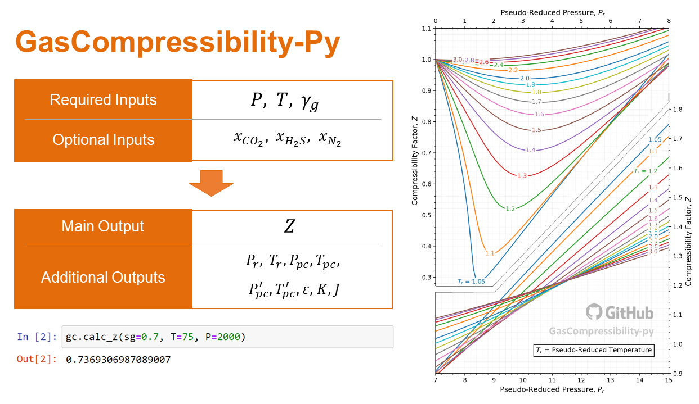
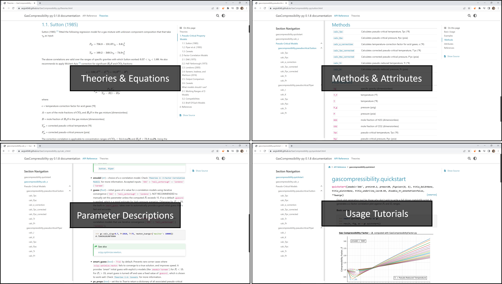
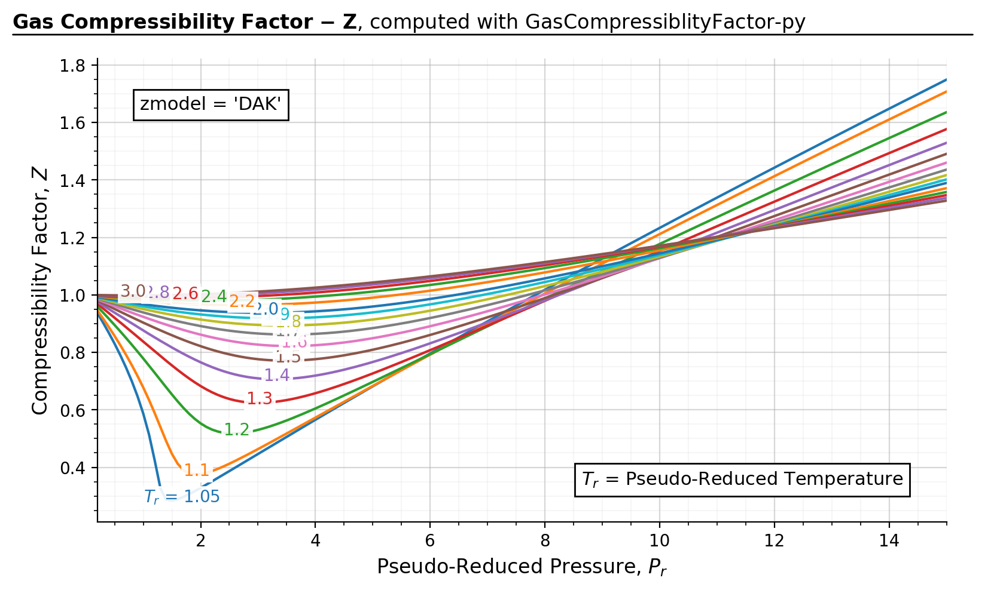

# GasCompressibility-py

GasCompressibility-py is a Python library for calculating the gas compressibility factor, $Z$, based on real gas law. It is designed with practical oil field application in mind, in which the required inputs ($T$, $P$, and $\gamma_{g}$) can be readily obtained from the surface facility.

If you like this package, please consider giving a star :star: on the top right corner!

## 0. Documentation

Have you ever had an experience of finding the package that piques your interest, only to give up a few moments later after finding out that it has an insane learning curve because the documentation sucks? Worry not. **The package comes with extensive documentation support.** If you have any questions or looking for tutorials, just skim through this README introduction or check out the [official documentation](https://aegis4048.github.io/GasCompressibility-py/theories.html). 

<a href="https://aegis4048.github.io/GasCompressibility-py/calc_z.html" target="_blank">
  
</a>

&nbsp;

Each page in the documentation have a Disqus plugin section where you can leave comments for any questions. Check the 
[Discussion Forum](https://aegis4048.github.io/GasCompressibility-py/discussion.html) page to post your questions!

## 1. Installation

The package is hosted on the [PyPi](https://pypi.org/project/gascompressibility/) page. You can remotely install it with the `pip` command:
```
pip install gascompressibility
```
To download the most recent version:
```
pip install gascompressibility --upgrade
```

If you are a chemical or petroleum engineer who doesn't know what `pip` is, read [below](#pip).

## 2. Quickstart

Check [gascompressibility.quickstart](https://aegis4048.github.io/GasCompressibility-py/quickstart.html) for more examples.

```python
>>> import gascompressibility as gc
>>> import matplotlib.pyplot as plt
>>>
>>> results, fig, ax = gc.quickstart(prmin=0.2, prmax=15, zmodel='DAK')
>>> plt.show()
```


## 3. Usage

The package allows for quick calculation of the z-factor from the gas specific gravity ($\gamma_{g}$), pressure ($P$), and temperature ($T$). Check [gascompressibility.calc_z](https://aegis4048.github.io/GasCompressibility-py/calc_z.html) for more examples.

**Basic (most common) usage:**
```python
>>> import gascompressibility as gc
>>>
>>> gc.calc_z(sg=0.7, T=75, P=2010)
0.7366562810878984
```
**In presence of significant non-hydrocarbon impurities:**
```python
>>> gc.calc_z(sg=0.7, T=75, P=2010, CO2=0.1, H2S=0.07, N2=0.05)
0.7765149771306533
```

**When pseudo-critical properties are known (not common):**

```python
>>> gc.calc_z(Pr=1.5, Tr=1.5)
0.859314380561347
```

**Picking correlation models of your choice**
```python
>>> gc.calc_z(sg=0.7, T=75, P=2010, zmodel='kareem', pmodel='sutton')
0.7150183342641309
```

**Returning all associated pseudo-critical properties computed**

```python
>>> gc.calc_z(sg=0.7, T=75, P=2010, ps_props=True)
{'z': 0.7366562810878984, 'Tpc': 371.4335560823552, 'Ppc': 660.6569792741872, 'J': 0.56221847, 'K': 14.450840999999999, 'Tr': 1.4394768357478496, 'Pr': 3.0646766226921294}
```
---------------

The package additionally supports calculation of pseudo-critical properties. Check
[gascompressibility.pseudocritical.Sutton](https://aegis4048.github.io/GasCompressibility-py/sutton.html) and
[gascompressibility.pseudocritical.Piper](https://aegis4048.github.io/GasCompressibility-py/piper.html) for more information.

**Reduced pressure calculation from specific gravity:**

```python
>>> from gascompressibility.pseudocritical import Piper
>>>
>>> Piper().calc_Pr(sg=0.7, N2=0.1, CO2=0.1, H2S=0.05, P=2010)
2.7950877932259734
```

**Pseudo-critical pressure calculation from specific gravity:**

```python
>>> Piper().calc_Ppc(sg=0.7, N2=0.1, CO2=0.1, H2S=0.05)
724.3779622618493
```

**Reduced pressure calculation from pseudo-critical pressure**
```python
>>> Piper().calc_Pr(Ppc=724.37, P=2010)
2.7951185167800987
```

## 4. Models Implemented

<ins><i>Pseudo-critical models</i></ins>

-   **Sutton (1985):** Makes corrections for acid fractions: $H_2S$ and
    $CO_2$
-   **Piper (1993):** Improved version of Sutton. Additionally supports
    corrections for $N_2$ along with $H_2S$ and $CO_2$
- [Theories 1: Pseudo-Critical Property Models](https://aegis4048.github.io/GasCompressibility-py/theories.html#pseudo-critical-property-models)

<ins><i>Z-factor models</i></ins>

-   **DAK (1975):** The most widely used z-factor model in the oil and
    gas industry for the past 40 years. You can\'t go wrong with this
    model
-   **Hall-Yarborough (1973):** Not recommended.
-   **Londono (2005):** Improved version of DAK. Math is exactly the
    same, but regression coefficients are fitted with 4x more data
    points.
-   **Kareem (2016):** Fast, but have shorter working ranges
    ($P_r < 15$)
-   [Theories 2: Z-Factor Correlation Models](https://aegis4048.github.io/GasCompressibility-py/theories.html#z-factor-correlation-models)

Not sure which model to use? You don\'t need to worry about it - default models (Piper + DAK) are more than good enough for real life applications. However, if computation speed is a big concern, use Kareem's method for z-factor correlation for $P_r < 15$. Check
[Theories 3: What models should I use?](https://aegis4048.github.io/GasCompressibility-py/theories.html#what-models-should-i-use) for more information.

## 5. Working Ranges

The below table summarizes the working $P_r$ and $T_r$ ranges of each
model, according to it\'s own original paper.


| Model           | $P_r$     | $T_r$     |
| --------------- | --------- | --------- |
| DAK             | [1, 3]    | [0.2, 30] |
| Hall-Yarborough | [1.15, 3] | (0, 20.5] |
| Londono         | [1, 3]    | [0.2, 30] |
| Kareem          | [1.15, 3] | [0.2, 15] |

However, normally we don't know the $P_r$ and $T_r$ values of a given mixture. The below figure summarizes the corresponding $P_r$ and $T_r$ (computed with Sutton's method) for each of specific gravity, temperature, and pressure ranges. For example, assuming $\gamma_{g}$ = 0.9 (green lines), z-factor correlation can't be used for extreme conditions like $P$ \> 19,000 psia, or $T$ \> 800 °F. If Kareem's method (`zmodel='kareem'`) is used for speed, you can't use it for $P$ \> 11,500 psia.


<details><summary>Figure source code</summary>

``` python
import matplotlib.pyplot as plt
import numpy as np
from gascompressibility.pseudocritical import Sutton

pmin = 0
pmax = 25000
Ps = np.linspace(pmin, pmax, 100)
Ps = np.array([round(P, 1) for P in Ps])

tmin = -459
tmax = 1500
Ts = np.linspace(tmin, tmax, 100)
Ts = np.array([round(T, 1) for T in Ts])

sgs = np.arange(0.1, 2.6, 0.4)
sgs = np.array([round(sg, 1) for sg in sgs])

results = {sg: {
    'Pr': np.array([]),
    'P': np.array([]),
    'Tr': np.array([]),
    'T': np.array([]),
} for sg in sgs}

for sg in sgs:
    for P in Ps:
        Pr = Sutton().calc_Pr(sg=sg, P=P)
        results[sg]['P'] = np.append(results[sg]['P'], [P], axis=0)
        results[sg]['Pr'] = np.append(results[sg]['Pr'], [Pr], axis=0)
    for T in Ts:
        Tr = Sutton().calc_Tr(sg=sg, T=T)
        results[sg]['T'] = np.append(results[sg]['T'], [T], axis=0)
        results[sg]['Tr'] = np.append(results[sg]['Tr'], [Tr], axis=0)

fig, axes = plt.subplots(1, 2, figsize=(9, 4))
for i, ax in enumerate(axes):
    if i == 0:
        for sg in sgs:
            Prs = results[sg]['Pr']
            Ps = results[sg]['P']

            p = ax.plot(Ps, Prs, label=sg)

            t = ax.text(Ps[-10], max(Prs) - 3, 'sg = ' + str(sg), color=p[0].get_color())
            t.set_bbox(dict(facecolor='white', alpha=0.7, edgecolor='white', pad=1))

        ax.text(0.06, 0.9, '$P_{r}$  approximation', fontsize=9, transform=ax.transAxes,
            bbox=dict(facecolor='white'))
        ax.set_ylabel('$P_r$', fontsize=11)
        ax.set_xlabel('Pressure (psia)')
        ymax = 60
        ax.hlines(y=30, xmin=pmin, xmax=pmax, color='k', linestyle='--', linewidth=0.8, alpha=0.7)
        ax.text(100, 31.3, '$P_r$ = 30.0', alpha=0.7)
        ax.hlines(y=15, xmin=pmin, xmax=pmax, color='k', linestyle='--', linewidth=0.8, alpha=0.7)
        ax.text(100, 16, '$P_r$ = 15.0', alpha=0.7)
        ax.hlines(y=1, xmin=pmin, xmax=pmax, color='k', linestyle='--', linewidth=0.8, alpha=0.7)
        ax.text(100, 2, '$P_r$ = 1.0', alpha=0.7)
        ax.fill_between(x=Ps, y1=1, y2=30, color='green', interpolate=True, alpha=0.1, zorder=-99)

    else:
        for sg in sgs:
            Trs = results[sg]['Tr']
            Ts = results[sg]['T']

            p = ax.plot(Ts, Trs, label=sg)

            t = ax.text(Ts[-1], max(Trs), 'sg = ' + str(sg), color=p[0].get_color())
            t.set_bbox(dict(facecolor='white', alpha=0.7, edgecolor='white', pad=1))

        ax.text(0.06, 0.9, '$T_{r}$  approximation', fontsize=9, transform=ax.transAxes,
            bbox=dict(facecolor='white'))
        ax.set_ylabel('$T_r$', fontsize=11)
        ax.set_xlabel('Temperature (°F)')
        ymax = 10
        ax.hlines(y=3, xmin=tmin, xmax=tmax, color='k', linestyle='--', linewidth=0.8, alpha=0.7)
        ax.text(tmin, 3.2, '$T_r$ = 3.0', alpha=0.7)
        ax.hlines(y=0.2, xmin=tmin, xmax=tmax, color='k', linestyle='--', linewidth=0.8, alpha=0.7)
        ax.text(tmin, 0.5, '$T_r$ = 0.2', alpha=0.7)
        ax.fill_between(x=Ts, y1=0.2, y2=3, color='green', interpolate=True, alpha=0.1, zorder=-99)


    ymin = 0 - 0.05 * ymax
    ax.set_ylim(ymin, ymax)

    ax.minorticks_on()
    ax.grid(alpha=0.5)
    ax.grid(visible=True, which='minor', alpha=0.1)
    ax.spines.top.set_visible(False)
    ax.spines.right.set_visible(False)


    def setbold(txt):
        return ' '.join([r"$\bf{" + item + "}$" for item in txt.split(' ')])

    bold_txt = setbold('Working Ranges of Z Models')
    plain_txt = ',  for each of specific gravity, pressure, and  temperature ranges'

    fig.suptitle(bold_txt + plain_txt,
                 verticalalignment='top', x=0, horizontalalignment='left', fontsize=11)
    yloc = 0.9
    ax.annotate('', xy=(0.01, yloc), xycoords='figure fraction', xytext=(1.02, yloc),
                arrowprops=dict(arrowstyle="-", color='k', lw=0.7))
    ax.text(0.95, 0.1, 'GasCompressibility-Py', fontsize=9, ha='right', va='center',
            transform=ax.transAxes, color='grey', alpha=0.5)

fig.tight_layout()
```
</details>

## 6. Tips

<details><summary><b>What does 'pip' mean?</b></summary>

If you are asking this question, you are probably a petroleum or chemical engineer with minimal programming knowledge. It's basically a command-line program that helps you download & install any open-source library with minimal hassle. Here I offer some practical tips for engineers not proficient in Python (yet...!):

1.  Download Anaconda from [here](https://www.anaconda.com/download).
2.  Run the downloaded file. It's filename will look something like
    this: "Anaconda3-2023.03-1-Windows-x86_64.exe"
3.  It will ask you to select destination folder. By default, its
    `C:\ProgramData\Anaconda3`
4.  If it asks you to check if you want to add Codna to the environtment
    PATH variable, check yes. It will say that it is not recommended,
    but trust me - this will make your life easier if you don't know
    what you are doing.
5.  Once installation is finished, go to windows search tab (bottom left
    corner of your screen). Type "cmd" and launch.
6.  If installation is done correctly, you should have `(base)` next to
    your current directory, like this: `(base) C:\Users\EricKim>`. If
    you don't see `(base)`, go to windows search tab again. Type
    "Anaconda". Click "Anaconda Prompt (Anaconda 3)" and launch it. If
    you still don't see `(base)`, you are about to do dive into some
    painful troubleshooting. Ask your friends who are good at Python to
    help you with it.
7.  If the Anaconda installation is done correctly, make your command
    line look like the following and press enter:
    `(base) C:\Users\EricKim>pip install gascompressibility`.
8.  Congrats! Installation is finished
9.  Type `(base) C:\Users\EricKim>Jupyter Notebook` and try the package
    on Jupyter Notebook.

</details>

## 7. References

<details><summary><b>Expand</b></summary>

\[1\] Sutton, R.P.: "Compressibility Factor for High-Molecular Weight
Reservoir Gases," paper SPE 14265 (1985).
[(link)](https://onepetro.org/SPEATCE/proceedings-abstract/85SPE/All-85SPE/SPE-14265-MS/61651)

\[2\] Piper, L.D., McCain Jr., W.D., and Corredor J.H.: "Compressibility
Factors for Naturally Occurring Petroleum Gases," paper SPE 26668
(1993).
[(link)](https://onepetro.org/SPEATCE/proceedings/93SPE/All-93SPE/SPE-26668-MS/55401)

\[3\] Dranchuk, P.M., and Abou-Kassem, J.H.: "Calculation of z-Factors
for Natural Gases Using Equations of State," *Journal of Canadian
Petroleum Technology* (1975).
[(link)](https://onepetro.org/JCPT/article-abstract/doi/10.2118/75-03-03)

\[4\] Kay, W.B: \"Density of Hydrocarbon Gases and Vapors at High
Temperature and Pressure,\" Industrial Engineering Chemistry (1936)

\[5\] Wichert, E.: "Compressibility Factor of Sour Natural Gases," MEng
Thesis, The University of Calgary, Alberta (1970)

\[6\] Stewart, W.F., Burkhardt, S.F., and Voo, D.: \"Prediction of
Pseudocritical Parameters for Mixtures,\" paper presented at the AIChE
Meeting, Kansas City, MO (May 18, 1959).

\[7\] Hall, K.R., and Yarborough, L.: "A new equation of state for
Z-factor calculations," *Oil and Gas Journal* (1973).
[(link)](https://www.researchgate.net/publication/284299884_A_new_equation_of_state_for_Z-factor_calculations)

\[8\] Londono, F.E., Archer, R.A., and Blasingame, T.A.: "Simplified
Correlations for Hydrocarbon Gas Viscosity and Gas Density ---
Validation and Correlation of Behavior Using a Large-Scale Database,"
paper SPE 75721 (2005).
[(link)](https://onepetro.org/SPEGTS/proceedings/02GTS/All-02GTS/SPE-75721-MS/135705)

\[9\] Kareem, L.A., Iwalewa, T.M., and Marhoun, M.al-.: "New explicit
correlation for the compressibility factor of natural gas: linearized
z-factor isotherms," *Journal of Petroleum Exploration and Production
Technology* (2016).
[(link)](https://link.springer.com/article/10.1007/s13202-015-0209-3)

\[10\] Elsharkawy, A.M., Aladwani, F., Alostad, N.: "Uncertainty in sour
gas viscosity estimation and its impact on inflow performance and
production forecasting," *Journal of Natural Gas Science and
Engineering* (2015).
[(link)](https://link.springer.com/article/10.1007/s13202-015-0209-3)

\[11\] Elsharkawy, A.M.: "Predicting the Properties of Sour Gases and
Condensates: Equations of State and Empirical Correlations," paper SPE
74369 (2002).
[(link)](https://onepetro.org/SPEIOCEM/proceedings-abstract/02IPCEM/All-02IPCEM/SPE-74369-MS/136841)

\[12\] Elsharkawy, A.M., and Elsharkawy, L.: "Predicting the
compressibility factor of natural gases containing various amounts of
CO2 at high temperatures and pressures," *Journal of Petroleum and Gas
Engineering* (2020).
[(link)](https://www.researchgate.net/publication/343309900_Predicting_the_compressibility_factor_of_natural_gases_containing_various_amounts_of_CO2_at_high_temperatures_and_pressures)

</details>

## 8. Requirements

Python =\> 3.8

1.  Numpy
2.  Scipy
3.  Matplotlib

## 9. Authors

-   [Eric 'Soobin' Kim](https://github.com/aegis4048) - Petroleum engineer with the gas compressor company, [Flogistix](https://flogistix.com/). Primary author of the package. (Contact | <aegis4048@gmail.com>, Website | [PythonicExcursions](https://aegis4048.github.io/))

## 10. License
The packages is under [MIT License](https://github.com/aegis4048/GasCompressibiltiy-py/blob/main/LICENSE) (no restrictions whatsoever). 

## 11. Cite As

Eric \"Soobin\" Kim, 2021, GasCompressibility-py Python Package, PyPI, Python Package Index, <https://pypi.org/project/gascompressibility/>.
