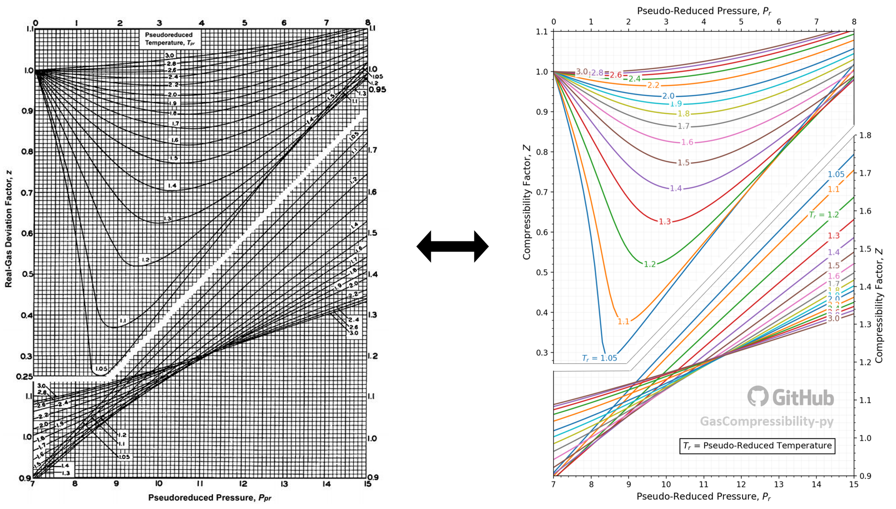

Z-Factor Correlation Models Explained
=====================================

This section explains the equations used for each correlation models
implemented in the following files:

-  DAK.py
-  hall_yarborough.py
-  londono.py
-  kareem.py

1. Basic Theory
---------------

The goal of all existing z-factor correlation models is to numerically
represent the famous Standing-Katz (SK) chart, correlating the
pseudo-critical properties, reduced pressure (:math:`P_{r}`) and reduced
temperature (:math:`T_{r}`), to the real gas compressibility factor
:math:`Z`. The calculation of the z-factor requires values of
:math:`P_{r}` and :math:`T_{r}`. If these aren’t available, they should
first be derived from pseudo-critical property models such as Sutton
(2016)\ `[7] <#ref-1>`__\  or Piper et al (1993)\ `[9] <#ref-1>`__\ .

Figure 1: Left is the original SK chart, and the right is the numerical
representation of the SK chart using the Dranchuk and Abu-Kassem (DAK)
model[1].

.. raw:: html

   

2. Implicit vs Explicit models
------------------------------

**Implicit** models require iterative convergence to find the root of
non-linear equations. From the Python point of view, this means that
they use ``scipy.optimize.newton()`` method. These models are
computationally much more expensive than explicit models. However,
providing a good initial guess for the z-factor can significantly reduce
computational cost. Initial guess of :math:`Z = 0.9` is a good starting
point for most applications in the oil field. This can be done by
setting ``calc_Z(guess=0.9)`` in this library.

*Models implemented:*

-  DAK (1975) [1]_
-  Hall-Yarborough (1973) [2]_
-  Londono (2005) [3]_

**Explicit** models require only 1 iteration. They are fast. These
models tend to be restricted by smaller applicable :math:`P_{r}` and
:math:`T_{r}` ranges and be less accurate than implicit models. It is
important to check the working ranges of the parameters before
implementing these models.

*Models implemented:*

-  Kareem, Iwalewa, and Marhoun (2016)\ `[4] <#ref-4>`__\

3. Equations used
-----------------

This section shows the equations used for each z-factor correlation
models.

3.1. DAK (1975)\ `[1] <#ref-1>`__\
~~~~~~~~~~~~~~~~~~~~~~~~~~~~~~~~~~~

This method requires iterative converge. The z-factor is computed by
setting :math:`z` as the root of the following non-linear equations:

.. math::

   \begin{align}
   0 &= 1 + \left( A_{1} + \frac{A_{2}}{T_{r}} +  \frac{A_{3}}{T_{r}^{3}} + \frac{A_{4}}{T_{r}^{4}} + \frac{A_{5}}{T_{r}^{5}}\right)\rho_{r} + \left( A_{6} + \frac{A_{7}}{T_{r}} + \frac{A_{8}}{T_{r}^{2}}\right)\rho_{r}^{2} \\
   & ~~~~-A_{9}\left( \frac{A_{7}}{T_{r}} + \frac{A_{8}}{T_{r}^{2}}\right) \rho_{r}^{5} + A_{10}\left( 1 + A_{11}\rho_{r}^{2}\right)\left( \frac{\rho_{r}^{2}}{T_{r}^{3}}\right)exp(-A_{11}\rho_{r}^{2}) - z \\
   \end{align}

and

.. math::

   \rho_{r} = \frac{0.27P_{r}}{zT_{r}}

where:

:math:`A_{1} = 0.3265 ~~~~~~~~~ A_{2} = -1.0700 ~~~~~~~~~ A_{3} = -0.5339`

:math:`A_{4}= 0.01569 ~~~~~~~ A_{5} = -0.05165 ~~~~~~~ A_{6} = 0.5475`

:math:`A_{7} = -0.7361 ~~~~~~ A_{8} = 0.1844 ~~~~~~~~~~~~ A_{9} = 0.1056`

:math:`A_{10} = 0.6134 ~~~~~~~~ A_{11} = 0.7210`

The model’s tested working ranges are: :math:`1 \leq T_{r} \leq 3` and
:math:`0.2 \leq P_{r} \leq 30`. The regression coefficients were fitted
on 1500 points. An average absolute error of 0.468% is reported in the
original paper.

This method is widely used in the petroleum
industry\ `[5] <#ref-5>`__\ .

**Code usage example:**

.. code:: python

   >>> import gascompressibility as gascomp
   >>> gascomp.calc_Z(Pr=3.1995, Tr=1.5006, guess=0.95)  # default: model='DAK', guess=0.9
   0.7730934971021097

3.2. Hall-Yarborough (1973)\ `[2] <#ref-2>`__\
~~~~~~~~~~~~~~~~~~~~~~~~~~~~~~~~~~~~~~~~~~~~~~~

This method requires iterative converge. The z-factor is computed by
setting :math:`z` as the root of the following non-linear equations:

.. math::

   0 = -A_{1}P_{r} + \frac{\rho_{r} + \rho_{r}^{2} + \rho_{r}^{3} - \rho_{r}^{4}}{(1 - \rho_{r})^{3}} - A_{2}\rho_{r}^{2} + A_{3}\rho_{r}^{A_{4}}

and

.. math::

   \rho_{r} = \frac{A_{1}P_{r}}{z}

where:

:math:`A_{1} = 0.06125te^{-1.2(1-t)^{2}}`

:math:`A_{2}=14.76t - 9.76t^{2} + 4.58t^{3}`

:math:`A_{3} = 90.7t - 242.2t^{2} + 42.4t^{3}`

:math:`A_{4} = 2.18 + 2.82t,`

:math:`t = 1 / T_{r}`,

The model’s tested working ranges are: :math:`1.15 < T_{r} \leq 3` and
:math:`0 < P_{r} \leq 20.5`. The regression coefficients were fitted
with 289 points. An average absolute error of 1.21% is reported in the
original paper.

This method has received great application in the natural gas
industry\ `[6] <#ref-6>`__\ .

**Code usage example:**

.. code:: python

   >>> import gascompressibility as gascomp
   >>> gascomp.calc_Z(model='hall_yarborough', Pr=3.1995, Tr=1.5006, guess=0.95)
   0.7714000268437691

3.3. Londono (2005)\ `[3] <#ref-3>`__\
~~~~~~~~~~~~~~~~~~~~~~~~~~~~~~~~~~~~~~~

Londono’s method is exactly the same as the DAK method, and requires
iterative converge. The only difference is that Londono further
optimized the eleven regression coefficients by using more data points.
DAK used 1500 points. Londono used 5960 points. The new regression
coefficients are as follows:

:math:`A_{1} = 0.3024696 ~~~~~~~~~~ A_{2} = -1.046964 ~~~~~~~~~~ A_{3} = -0.1078916`

:math:`A_{4}= -0.7694186 ~~~~~~~ A_{5} = 0.1965439 ~~~~~~~~~~~ A_{6} =0.6527819`

:math:`A_{7} = -1.118884 ~~~~~~~~~ A_{8} = 0.3951957 ~~~~~~~~~~~ A_{9} = 0.09313593`

:math:`A_{10} = 0.8483081 ~~~~~~~~~ A_{11} = 0.7880011`

The original paper does not mention any tested working ranges of
:math:`P_{r}` and :math:`T_{r}`. However, it is logical to assume it’s
working ranges to be the same as the those of the DAK method,
:math:`1 \leq T_{r} \leq 3` and :math:`0.2 \leq P_{r} \leq 30`, since
the underlying math is the same. An average absolute error of 0.412% is
reported in the original paper.

**Code usage example:**

.. code:: python

   >>> import gascompressibility as gascomp
   >>> gascomp.calc_Z(model='londono', Pr=3.1995, Tr=1.5006, guess=0.95)
   0.7754849921456451

3.4. Kareem, Iwalewa, and Marhoun (2016)\ `[4] <#ref-4>`__\
~~~~~~~~~~~~~~~~~~~~~~~~~~~~~~~~~~~~~~~~~~~~~~~~~~~~~~~~~~~~

This method is an adapted form of the Hall-Yarborough method. This
method DOES NOT require iterative convergence. The z-factor can be
calculated by:

.. math::

   z = \frac{DP_{r}(1 + \rho_{r} + \rho_{r}^{2} -  \rho_{r}^{3})}{(DP_{r} + E \rho_{r}^{2} - F \rho_{r}^{G})(1- \rho_{r})^{3}}

and

.. math::

   \rho_{r} = \frac{DP_{r}}{\left(\frac{1 + A^{2}}{C} -\frac{A^{2}B}{C^{3}} \right)}

where:

:math:`A = a_{1}te^{a_{2}(1-t)^{2}}P_{r}`

:math:`B = a_{3}t + a_{4}t^{2} + a_{5}t^{6}P_{r}^{6}`

:math:`C = a_{9} + a_{8}tP_{r} + a_{7}t^{2}P_{r}^{2} + a_{6}t^{3}P_{r}^{3}`

:math:`D = a_{10}te^{a_{11}(1-t)^{2}}`

:math:`E = a_{12}t + a_{13}t^{2} + a_{14}t^{3}`

:math:`F = a_{15}t + a_{16}t^{2} + a_{17}t^{3}`

:math:`G = a_{18} + a_{19}t`

:math:`t = \frac{1}{T_{r}}`

:math:`A_{1} = 0.317842 ~~~~~~~~~~~~~~ A_{2} = 0.382216 ~~~~~~~~~~ A_{3} = -7.76835 ~~~~~~~~~A_{4}= 14.2905 ~~~~~~~~~ A_{5} = 0.00000218363`

:math:`A_{6} = -0.00469257 ~~~~~~~ A_{7} = 0.0962541 ~~~~~~~~ A_{8} = 0.16672 ~~~~~~~~~~~~A_{9}= 0.96691 ~~~~~~~~~ A_{10} = 0.063069`

:math:`A_{11} = -1.966847 ~~~~~~~~~ A_{12} = 21.0581 ~~~~~~~~~~~ A_{13} = -27.0246 ~~~~~~~~A_{14}= 16.23 ~~~~~~~~~~~ A_{15} = 207.783`

:math:`A_{16} = -488.161 ~~~~~~~~~~~ A_{17} = 176.29 ~~~~~~~~~~~~~ A_{18} = 1.88453 ~~~~~~~~~~~A_{19}= 3.05921`

The model’s tested working ranges are: :math:`1.15 < T_{r} \leq 3` and
:math:`0.2 \leq P_{r} \leq 15`. The regression coefficients were fitted
with 5346 points. An average absolute error of 0.4379% is reported in
the original paper. For the range outside the coverage of this
correlation, the authors recommend using implicit correlations. However,
this explicit correlation can be used to provide an initial guess to
speed up the iteration process.

**Code usage example:**

.. code:: python

   >>> import gascompressibility as gascomp
   >>> gascomp.calc_Z(model='kareem', Pr=3.1995, Tr=1.5006)
   0.7667583024871576

4. What model should I use?
---------------------------

An answer to this question needs to consider the following three
criteria.

4.1. Computational cost is a big concern
~~~~~~~~~~~~~~~~~~~~~~~~~~~~~~~~~~~~~~~~

Use the method of Kareem et al (2016)\ `[4] <#ref-4>`__\ . This is an
explicit model that does not require iterative convergence. Note that
the model’s working ranges are :math:`1.15 < T_{r} \leq 3` and
:math:`0.2 \leq P_{r} \leq 15`.

4.2. You know :math:`P_{r}` and :math:`T_{r}`
~~~~~~~~~~~~~~~~~~~~~~~~~~~~~~~~~~~~~~~~~~~~~

If you already know your substance’s pseudo-critical properties,

-  **DAK** has been the most widely used model in the petroleum industry
   for the past 40+ years. **You can’t go wrong with this model.**
-  If you really care about small accuracy improvement, go with
   Londono’s method. The underlying math is exactly the same as DAK,
   except Londono’s coefficients are better than those of the DAK’s
   because it used more 4x more data points. Personally, I would use
   this model.
-  I don’t recommend using Hall-Yarborough model. It is older than DAK,
   used less data points, has bigger average absolute error, and has
   narrower working ranges for :math:`P_{r}` and :math:`T_{r}`. But if
   you do have a reason to use this model, go head. Note that this model
   is still robust enough for practical usage in the oil field.

4.3. You don’t know :math:`P_{r}` and :math:`T_{r}`
~~~~~~~~~~~~~~~~~~~~~~~~~~~~~~~~~~~~~~~~~~~~~~~~~~~

Numerical representation of the SK chart from the z-factor correlation
models require :math:`P_{r}` and :math:`T_{r}` as inputs. If you don’t
have these values, you need to first derive them using one of the
pseudo-critical property correlation models. *GasCompressibility-py*
currently supports two pseudo-critical models:

-  Sutton’s gas specific gravity correlation\ `[7] <#ref-7>`__\  in
   conjunction with Wichert-Aziz correction for gases with
   :math:`H_{2}S` and :math:`CO_{2}` fractions\ `[8] <#ref-8>`__\
-  Piper’s gas specific gravity correlation for gases with
   :math:`H_{2}S`, :math:`CO_{2}` and :math:`N_{2}`
   fractions\ `[9] <#ref-9>`__\

Which combination of pseudo-critical model should you use with which
z-factor correlation model? The below table presented in Elsharkawy and
Elsharkawy (2020)[10] may shed light on determining which combination
should be used:

.. raw:: html

   

Table 1: Performance evaluation of various pseudo-critical property
models in conjunction with various z-factor correlation models[10].

.. raw:: html

   

The table dictates that **Sutton’s pseudo-critical property model with
Londono’s z-factor correlation model yields the highest coefficient of
determination (:math:`R^{2}`) of 0.974.** However, so long as the models
implemented in this package are concerned, you can use any combination
you want. They all have :math:`R^{2} \geq 0.957`, which is good enough
for practical usage in real life applications.

5. Code Usage
-------------

``calc_Z`` method takes two required keyword arguments (``Tr`` and
``Pr``) and three optional keyword arguments with pre-set default values
(``model='DAK'``, ``guess=0.9123676532``, and ``newton_kwargs=None``).

All models take 2 required inputs: ``Tr`` and ``Pr``. These inputs can
be passed in a form of keyword arguments:

.. code:: python

   >>> gascomp.calc_Z(Pr=3.1995, Tr=1.5006)  # default model='DAK'

Or just arguments:

.. code:: python

   >>> gascomp.calc_Z(3.1995, 1.5006)

You can pick the model of your choice by setting the ``model``
parameter.

.. code:: python

   >>> gascomp.calc_Z(Pr=3.1995, Tr=1.5006, model='hall-yarborough')

Currently ``model`` accepts four string inputs: ``'DAK'``,
``'hall_yarborough'``, ``'londono'`` and ``'kareem'``.

Implicit models ``DAK``, ``hall_yarborough``, and ``londono`` internally
uses ``scipy.optimize.newton`` for iterative convergence. They can take
two optional keyword arguments and pass them to the
``scipy.optimize.newton`` method: ``guess``, and ``newton_kwargs``.

``guess`` corresponds to ``x0`` and ``newton_kwargs`` corresponds to the
rest of the keyword arguments of the ``scipy.optimize.newton`` `(scipy
documentation) <https://docs.scipy.org/doc/scipy/reference/generated/scipy.optimize.newton.html>`__.

For example, if you want to pass ``x0=0.9, maxiter=100, rtol=0.1`` to
``scipy.optimize.newton``:

.. code:: python

   >>> gascomp.calc_Z(Pr=3.1995, Tr=1.5006, guess=0.9, newton_kwargs={'maxiter': 100, 'rtol': 0.1})

For more examples, refer to the tutorial jupyter notebook (coming soon).

References
==========

.. [1] Dranchuk, P.M., and Abou-Kassem, J.H.: “Calculation of z-Factors for Natural Gases Using Equations of State,” *Journal of Canadian Petroleum Technology* (1975). `(link) <https://onepetro.org/JCPT/article-abstract/doi/10.2118/75-03-03>`__

.. [2] Hall, K.R., and Yarborough, L.: “A new equation of state for Z-factor calculations,” *Oil and Gas Journal* (1973). `(link) <https://www.researchgate.net/publication/284299884_A_new_equation_of_state_for_Z-factor_calculations>`__

.. [3] Londono, F.E., Archer, R.A., and Blasingame, T.A.: “Simplified Correlations for Hydrocarbon Gas Viscosity and Gas Density — Validation and Correlation of Behavior Using a Large-Scale Database,” paper SPE 75721 (2005). `(link) <https://onepetro.org/SPEGTS/proceedings/02GTS/All-02GTS/SPE-75721-MS/135705>`__

.. [4] Kareem, L.A., Iwalewa, T.M., and Marhoun, M.al-.: “New explicit correlation for the compressibility factor of natural gas: linearized z-factor isotherms,” *Journal of Petroleum Exploration and Production Technology* (2016). `(link) <https://link.springer.com/article/10.1007/s13202-015-0209-3>`__

.. [5] Elsharkawy, A.M., Aladwani, F., Alostad, N.: “Uncertainty in sour gas viscosity estimation and its impact on inflow performance and production forecasting,” *Journal of Natural Gas Science and Engineering* (2015). `(link) <https://link.springer.com/article/10.1007/s13202-015-0209-3>`__

.. [6] Elsharkawy, A.M.: “Predicting the Properties of Sour Gases and Condensates: Equations of State and Empirical Correlations,” paper SPE 74369 (2002). `(link) <https://onepetro.org/SPEIOCEM/proceedings-abstract/02IPCEM/All-02IPCEM/SPE-74369-MS/136841>`__

.. [7] Sutton, R.P.: “Compressibility Factor for High-Molecular Weight Reservoir Gases,” paper SPE 14265 (1985). `(link) <https://onepetro.org/SPEATCE/proceedings-abstract/85SPE/All-85SPE/SPE-14265-MS/61651>`__

.. [8] Wichert, E.: “Compressibility Factor of Sour Natural Gases,” MEng Thesis, The University of Calgary, Alberta (1970)

.. [9] Piper, L.D., McCain Jr., W.D., and Corredor J.H.: “Compressibility Factors for Naturally Occurring Petroleum Gases,” paper SPE 26668 (1993). `(link) <https://onepetro.org/SPEATCE/proceedings/93SPE/All-93SPE/SPE-26668-MS/55401>`__

.. [10] Elsharkawy, A.M., and Elsharkawy, L.: “Predicting the compressibility factor of natural gases containing various amounts of CO2 at high temperatures and pressures,” *Journal of Petroleum and Gas Engineering* (2020). `(link) <https://www.researchgate.net/publication/343309900_Predicting_the_compressibility_factor_of_natural_gases_containing_various_amounts_of_CO2_at_high_temperatures_and_pressures>`__
