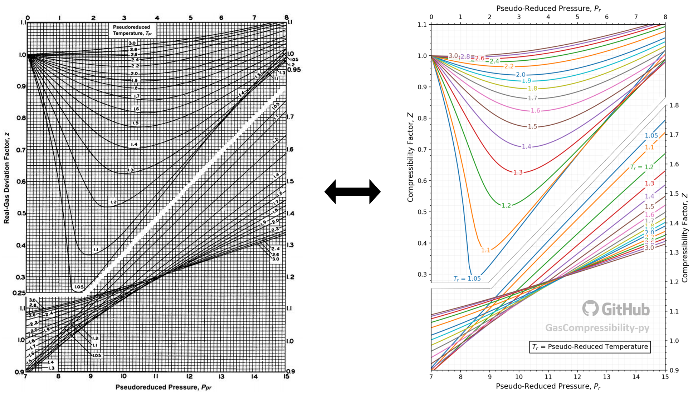
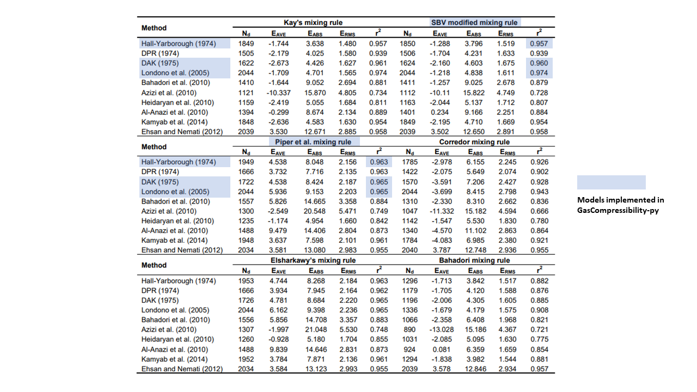

.. role:: underline
    :class: underline

.. role:: underline_italic
    :class: underline_italic

.. role:: display_none
    :class: display_none

.. role:: vertical_spaceholder
    :class: vertical_spaceholder

Theories
----------------------------------

The goal of all existing z-factor correlation models is to numerically
represent the famous Standing-Katz (SK) chart, correlating the
pseudo-critical properties, reduced pressure (:math:`P_{r}`) and reduced
temperature (:math:`T_{r}`), to the real gas compressibility factor
:math:`Z`. In the other words, **calculation of the z-factor requires
values of** :math:`P_{r}` **and** :math:`T_{r}`.

In real life applications, no one knows the exact :math:`P_{r}` and
:math:`T_{r}` values of his gas mixture. This is where pseudo-critical
property models, such as Sutton (1985) [1]_ and Piper et al (1993) [2]_,
comes in handy by approximating them from gas specific gravity
(:math:`\gamma_g`), which is relatively easy to obtain from lab sample
analysis.

This section explains the basic theories behind :math:`P_{r}` and
:math:`T_{r}` correlation from specific gravity and the subsequent
z-factor correlation from the computed :math:`P_{r}` and :math:`T_{r}`.

Figure 1: Left is the original SK chart, and the right is the numerical
representation of the SK chart using the Dranchuk and Abu-Kassem (DAK)
model [3]_.

.. raw:: html

   

1. Pseudo-Critical Property Models
----------------------------------

The z-factor can be derived from :math:`P_{r}` and :math:`T_{r}` through
visual inspection of the SK chart or through numerical computation using
various z-factor correlation models. In the other words, z-factor is a
function of pseudo-reduced pressure and temperature:

.. math::

   Z = f(P_{r}, T_{r})

:math:`P_{r}` and :math:`T_{r}` are defined as the pressure and
temperature divided by the mixture’s pseudo-critical pressure
(:math:`P_{pc}`) and and temperature (:math:`T_{pc}`):

.. math::

   P_{r} = \frac{P}{P_{pc}}, ~~~~~~~ T_{r} = \frac{T}{T_{pc}}

Kay (1936) [4]_ stated that :math:`P_{pc}` and :math:`T_{pc}` of a gas
mixture can be expressed as the mole fraction (:math:`x`) weighted
average of the critical pressure (:math:`P_c`) and temperature
(:math:`T_c`) of the mixture’s individual component (:math:`i`):

.. math::

   P_{pc}=\sum x_{i} P_{c_{i}}, ~~~~~~~T_{pc}=\sum x_{i} T_{c_{i}}

However, this method is too inconvenient because you have to manually
input individual component’s :math:`P_c`, :math:`T_c`, and :math:`x`,
which can be time-consuming. Furthermore, this isn’t practical for oil
field applications in which the lab analysis of the “heavy-ends” are
often lumped up together and reported as :math:`C_{6}^{+}` or
:math:`C_{7}^{+}`. This makes it impossible to know the mole fractions
of the components heavier than :math:`C_{6}` or :math:`C_{7}`.

This section introduces various pseudo-critical property models that
correlates a gas mixture’s specific gravity (:math:`\gamma_{g}`) to its
corresponding :math:`P_{pc}` and :math:`T_{pc}`.

1.1. Sutton (1985)
~~~~~~~~~~~~~~~~~~

Sutton (1985) [1]_ fitted the following regression model for a gas mixture
with unknown component composition that that take :math:`\gamma_{g}` as
input:

.. math::

   P_{pc} = 756.8 - 131.07\gamma_{g} - 3.6\gamma^{2}_{g}

.. math::

   T_{pc} = 169.2 - 349.5\gamma_{g} - 74.0\gamma^{2}_{g}

The above correlations are valid over the ranges of specific gravities
with which Sutton worked: :math:`0.57 < \gamma_{g} < 1.68`. He also
recommends to apply Wichert-Aziz [5]_ correction for
significant :math:`H_2S` and :math:`CO_2` fractions:

.. math::

   \epsilon = 120 (A^{0.9} - A^{1.6}) + 15(B^{0.5} - B^{4})

.. math::

   T_{pc}^{'} = T_{pc} - \epsilon

.. math::

   P_{pc}^{'} = \frac{P_{pc}T_{pc}^{'}}{T_{pc} - B(1 - B)\epsilon}

where:

:math:`\epsilon` = temperature-correction factor for acid gases [°R]

:math:`A` = sum of the mole fractions of :math:`CO_2` and :math:`H_2S`
in the gas mixture [dimensionless]

:math:`B` = mole fraction of :math:`H_2S` in the gas mixture
[dimensionless]

:math:`T^{'}_{pc}` = corrected pseudo-critical temperature [°R]

:math:`P^{'}_{pc}` = corrected pseudo-critical pressure [psia]

The correction correlation is applicable to concentration ranges of
:math:`CO_2 < 54.4 \space mol`\ **%** and
:math:`H_2S < 73.8 \space mol`\ **%**. Using the Dranchuk and Abu-Kassem
(DAK) method [3]_  as a z-factor correlation model,
Sutton’s correlation model reported an average absolute error of 1.418%.
The regression coefficients were fitted with 289 points.

1.2. Piper et al. (1993)
~~~~~~~~~~~~~~~~~~~~~~~~

Piper et al. (1993) [2]_ adapted the method of Stewart et al. (1959) [6]_ to
calculate the pseudo-critical properties of gas mixtures with nitrogen
(:math:`N_2`), :math:`CO_2`, and :math:`H_2S` fractions:

.. math::

   T_{pc} = \frac{K^{2}}{J}, ~~~~~~~P_{pc} = \frac{T_{pc}}{J}

and

.. math::

   \begin{align}
   J &= 0.11582  - 0.45820 x_{H_2S}\left(\frac{T_c}{P_c}\right)\_{H_2S} - 0.90348 x_{CO_2}\left(\frac{T_c}{P_c}\right)\_{CO_2} - 0.66026 x_{N_2}\left(\frac{T_c}{P_c}\right)\_{N_2} \\
   \\
   &~~~~~~~~~~~~~~~~~~~~~~~~~~~~~~~~~~~~~~~~~~~~~~~~~~~~~~~~~~~~~~ + 0.70729\gamma_{g} - 0.099397 \gamma^{2}\_{g}\\
   \\
   K &= 3.8216 -0.06534 x_{H_2S}\left(\frac{T_c}{\sqrt{P_c}}\right)\_{H_2S} - 0.42113 x_{CO_2}\left(\frac{T_c}{\sqrt{P_c}}\right)\_{CO_2} - 0.91249 x_{N_2}\left(\frac{T_c}{\sqrt{P_c}}\right)\_{N_2} \\
   \\
   &~~~~~~~~~~~~~~~~~~~~~~~~~~~~~~~~~~~~~~~~~~~~~~~~~~~~~~~~~~~~~~~ + 17.438\gamma_{g} - 3.2191 \gamma^{2}\_{g}\\
   \end{align}

where:

:math:`J` = Steward, Burkhardt, and Voo (SBV) parameter [°R/psia]

:math:`K` = SBV parameter [°R/psia^0.5]

:math:`x_{H_2S}` = mole fraction of :math:`H_2S` [dimensionless]

:math:`x_{CO_2}` = mole fraction of :math:`CO_2` [dimensionless]

:math:`x_{N2}` = mole fraction of :math:`N_2` [dimensionless]

Piper’s correction for non-hydrocarbon impurities have working ranges of
:math:`H_2S < 51.37 \space mol`\ **%**,
:math:`CO_2 < 67.16 \space mol`\ **%**, and
:math:`N_2 < 15.68 \space mol`\ **%**. Using the DAK method [3]_ as a
z-factor correlation model, Piper’s crrelation model reported an average
absolute error of 1.304%. The regression coefficients were fitted with
896 points.

1.3. Caveats
~~~~~~~~~~~~

**1) The models work only for “naturally occurring” hydrocarbon gases**

The models implemented in this library correlates :math:`\gamma_{g}` to
the corresponding :math:`P_{pc}` and :math:`T_{pc}` by using the fitted
regression coefficients. This means that the working range of the models
will be limited by the range of the data points used to fit the
coefficients. All pseudo-critical models (that I know of) are developed
using only the naturally occurring gas samples. Therefore, it is not
recommended to use these models for synthetic gases. If you are dealing
with synthetic gases, I recommend using Kay’s (1936) [4]_
method.

**2) Correction is necessary in presence of significant impurities
fractions**

Sutton’s method (1985) [1]_  can apply correction for
:math:`H_{2}S` and :math:`CO_2`:

.. code:: python

   >>> from gascompressibility.pseudocritical import Sutton
   >>>
   >>> Sutton().calc_Tr(sg=0.7, T=75, CO2=0.1, H2S=0.07)
   1.5005661019949397

Piper’s method (1993) [2]_  can apply correction for
:math:`H_{2}S`, :math:`CO_2`, and :math:`N_2`:

.. code:: python

   >>> from gascompressibility.pseudocritical import Piper
   >>>
   >>> Piper().calc_Tr(sg=0.7, T=75, CO2=0.1, H2S=0.07, N2=0.1)
   1.5483056093175225

2. Z-Factor Correlation Models
------------------------------

There are two kinds of models for z-factor correlation: **Implicit
vs. Explicit models**

**Implicit** models require iterative convergence to find the root of
non-linear equations. From the Python point of view, this means that
they use ``scipy.optimize.newton()`` method. These models are
computationally much more expensive than explicit models. However,
providing a good initial guess for the z-factor can significantly reduce
computational cost. Initial guess of :math:`Z = 0.9` is a good starting
point for most applications in the oil field. This can be done by
setting ``calc_z(guess=0.9)`` in this library (however, this is unnecessary if you set
``smart_guess=True``).

:underline_italic:`Models implemented:`

-  DAK (1975) [3]_
-  Hall-Yarborough (1973) [7]_
-  Londono (2005) [8]_

**Explicit** models require only 1 iteration. They are fast. These
models tend to be restricted by smaller applicable :math:`P_{r}` and
:math:`T_{r}` ranges and be less accurate than implicit models. It is
important to check the working ranges of the parameters before
implementing these models.

:underline_italic:`Models implemented:`

-  Kareem, Iwalewa, and Marhoun (2016) [9]_

2.1. DAK (1975)
~~~~~~~~~~~~~~~~~~~~~~~~~~~~~~~~~~~

This method requires iterative converge. The z-factor is computed by
setting :math:`z` as the root of the following non-linear equations:

.. math::

   \begin{align}
   0 &= 1 + \left( A_{1} + \frac{A_{2}}{T_{r}} +  \frac{A_{3}}{T_{r}^{3}} + \frac{A_{4}}{T_{r}^{4}} + \frac{A_{5}}{T_{r}^{5}}\right)\rho_{r} + \left( A_{6} + \frac{A_{7}}{T_{r}} + \frac{A_{8}}{T_{r}^{2}}\right)\rho_{r}^{2} \\
   & ~~~~-A_{9}\left( \frac{A_{7}}{T_{r}} + \frac{A_{8}}{T_{r}^{2}}\right) \rho_{r}^{5} + A_{10}\left( 1 + A_{11}\rho_{r}^{2}\right)\left( \frac{\rho_{r}^{2}}{T_{r}^{3}}\right)exp(-A_{11}\rho_{r}^{2}) - z \\
   \end{align}

and

.. math::

   \rho_{r} = \frac{0.27P_{r}}{zT_{r}}

where:

:math:`A_{1} = 0.3265 ~~~~~~~~~ A_{2} = -1.0700 ~~~~~~~~~ A_{3} = -0.5339`

:math:`A_{4}= 0.01569 ~~~~~~~ A_{5} = -0.05165 ~~~~~~~ A_{6} = 0.5475`

:math:`A_{7} = -0.7361 ~~~~~~ A_{8} = 0.1844 ~~~~~~~~~~~~ A_{9} = 0.1056`

:math:`A_{10} = 0.6134 ~~~~~~~~ A_{11} = 0.7210`

The model’s tested working ranges are: :math:`1 \leq T_{r} \leq 3` and
:math:`0.2 \leq P_{r} \leq 30`. The regression coefficients were fitted
on 1500 points. An average absolute error of 0.468% is reported in the
original paper.

This method is widely used in the petroleum industry [10]_.

**Code usage example:**

.. code:: python

   >>> import gascompressibility as gc
   >>> gc.calc_z(Pr=3.1995, Tr=1.5006)  # default: model='DAK'
   0.7730934971021096

2.2. Hall-Yarborough (1973)
~~~~~~~~~~~~~~~~~~~~~~~~~~~~~~~~~~~~~~~~~~~~~~~

This method requires iterative converge. The z-factor is computed by
setting :math:`z` as the root of the following non-linear equations:

.. math::

   0 = -A_{1}P_{r} + \frac{\rho_{r} + \rho_{r}^{2} + \rho_{r}^{3} - \rho_{r}^{4}}{(1 - \rho_{r})^{3}} - A_{2}\rho_{r}^{2} + A_{3}\rho_{r}^{A_{4}}

and

.. math::

   \rho_{r} = \frac{A_{1}P_{r}}{z}

where:

:math:`A_{1} = 0.06125te^{-1.2(1-t)^{2}}`

:math:`A_{2}=14.76t - 9.76t^{2} + 4.58t^{3}`

:math:`A_{3} = 90.7t - 242.2t^{2} + 42.4t^{3}`

:math:`A_{4} = 2.18 + 2.82t,`

:math:`t = 1 / T_{r}`,

The model’s tested working ranges are: :math:`1.15 < T_{r} \leq 3` and
:math:`0 < P_{r} \leq 20.5`. The regression coefficients were fitted
with 289 points. An average absolute error of 1.21% is reported in the
original paper.

This method has received great application in the natural gas
industry [11]_.

**Code usage example:**

.. code:: python

   >>> import gascompressibility as gc
   >>> gc.calc_z(zmodel='hall_yarborough', Pr=3.1995, Tr=1.5006)
   0.77140002684377

2.3. Londono (2005)
~~~~~~~~~~~~~~~~~~~~~~~~~~~~~~~~~~~~~~~

Londono’s method is exactly the same as the DAK method, and requires
iterative converge. The only difference is that Londono further
optimized the eleven regression coefficients by using more data points.
DAK used 1500 points. Londono used 5960 points. The new regression
coefficients are as follows:

:math:`A_{1} = 0.3024696 ~~~~~~~~~~ A_{2} = -1.046964 ~~~~~~~~~~ A_{3} = -0.1078916`

:math:`A_{4}= -0.7694186 ~~~~~~~ A_{5} = 0.1965439 ~~~~~~~~~~~ A_{6} =0.6527819`

:math:`A_{7} = -1.118884 ~~~~~~~~~ A_{8} = 0.3951957 ~~~~~~~~~~~ A_{9} = 0.09313593`

:math:`A_{10} = 0.8483081 ~~~~~~~~~ A_{11} = 0.7880011`

The original paper does not mention any tested working ranges of
:math:`P_{r}` and :math:`T_{r}`. However, it is logical to assume it’s
working ranges to be the same as the those of the DAK method,
:math:`1 \leq T_{r} \leq 3` and :math:`0.2 \leq P_{r} \leq 30`, since
the underlying math is the same. An average absolute error of 0.412% is
reported in the original paper.

**Code usage example:**

.. code:: python

   >>> import gascompressibility as gc
   >>> gc.calc_z(zmodel='londono', Pr=3.19, Tr=1.5)
   0.7752626795793716

2.4. Kareem, Iwalewa, and Marhoun (2016)
~~~~~~~~~~~~~~~~~~~~~~~~~~~~~~~~~~~~~~~~~~~~~~~~~~~~~~~~~~~~

This method is an adapted form of the Hall-Yarborough method. This
method DOES NOT require iterative convergence. The z-factor can be
calculated by:

.. math::

   z = \frac{DP_{r}(1 + \rho_{r} + \rho_{r}^{2} -  \rho_{r}^{3})}{(DP_{r} + E \rho_{r}^{2} - F \rho_{r}^{G})(1- \rho_{r})^{3}}

and

.. math::

   \rho_{r} = \frac{DP_{r}}{\left(\frac{1 + A^{2}}{C} -\frac{A^{2}B}{C^{3}} \right)}

where:

:math:`A = a_{1}te^{a_{2}(1-t)^{2}}P_{r}`

:math:`B = a_{3}t + a_{4}t^{2} + a_{5}t^{6}P_{r}^{6}`

:math:`C = a_{9} + a_{8}tP_{r} + a_{7}t^{2}P_{r}^{2} + a_{6}t^{3}P_{r}^{3}`

:math:`D = a_{10}te^{a_{11}(1-t)^{2}}`

:math:`E = a_{12}t + a_{13}t^{2} + a_{14}t^{3}`

:math:`F = a_{15}t + a_{16}t^{2} + a_{17}t^{3}`

:math:`G = a_{18} + a_{19}t`

:math:`t = \frac{1}{T_{r}}`

:math:`A_{1} = 0.317842 ~~~~~~~~~~~~~~ A_{2} = 0.382216 ~~~~~~~~~~ A_{3} = -7.76835 ~~~~~~~~~A_{4}= 14.2905 ~~~~~~~~~ A_{5} = 0.00000218363`

:math:`A_{6} = -0.00469257 ~~~~~~~ A_{7} = 0.0962541 ~~~~~~~~ A_{8} = 0.16672 ~~~~~~~~~~~~A_{9}= 0.96691 ~~~~~~~~~ A_{10} = 0.063069`

:math:`A_{11} = -1.966847 ~~~~~~~~~ A_{12} = 21.0581 ~~~~~~~~~~~ A_{13} = -27.0246 ~~~~~~~~A_{14}= 16.23 ~~~~~~~~~~~ A_{15} = 207.783`

:math:`A_{16} = -488.161 ~~~~~~~~~~~ A_{17} = 176.29 ~~~~~~~~~~~~~ A_{18} = 1.88453 ~~~~~~~~~~~A_{19}= 3.05921`

The model’s tested working ranges are: :math:`1.15 < T_{r} \leq 3` and
:math:`0.2 \leq P_{r} \leq 15`. The regression coefficients were fitted
with 5346 points. An average absolute error of 0.4379% is reported in
the original paper. For the range outside the coverage of this
correlation, the authors recommend using implicit correlations. However,
this explicit correlation can be used to provide an initial guess to
speed up the iteration process.

**Code usage example:**

.. code:: python

   >>> import gascompressibility as gc
   >>> gc.calc_z(zmodel='kareem', Pr=3.1995, Tr=1.5006)
   0.7667583024871576

2.5. Output Comparison
~~~~~~~~~~~~~~~~~~~~~~~~~~~~~~~~~~~~~~~~~~~~~~~

**For 0.2 <** :math:`P_{r}` **< 15:**

.. tab-set::

    .. tab-item:: DAK

        .. figure:: _static/DAK-15.png
           :class: width-80 responsive-full-width
           :align: center
        .. code-block:: python

           import gascompressibility as gc

           results, fig, ax = gc.quickstart(zmodel='hall_yarborough', prmin=0.2, prmax=15, figsize=(8, 5))
           ax.set_ylim(0.2, 1.8)

    .. tab-item:: Londono

        .. figure:: _static/londono-15.png
           :class: width-80 responsive-full-width
           :align: center
        .. code-block:: python

           import gascompressibility as gc

           results, fig, ax = gc.quickstart(zmodel='londono', prmin=0.2, prmax=15, figsize=(8, 5))
           ax.set_ylim(0.2, 1.8)

    .. tab-item:: Hall-Yarborough

        .. figure:: _static/hall_yarborough-15.png
           :class: width-80 responsive-full-width
           :align: center
        .. code-block:: python

           import gascompressibility as gc

           results, fig, ax = gc.quickstart(zmodel='hall_yarborough', prmin=0.2, prmax=15, figsize=(8, 5))
           ax.set_ylim(0.2, 1.8)

    .. tab-item:: Kareem

        .. figure:: _static/kareem-15.png
           :class: width-80 responsive-full-width
           :align: center
        .. code-block:: python

           import gascompressibility as gc

           results, fig, ax = gc.quickstart(zmodel='kareem', prmin=0.2, prmax=15, figsize=(8, 5))
           ax.set_ylim(0.2, 1.8)

**For 0.2 <** :math:`P_{r}` **< 30:**

.. tab-set::

    .. tab-item:: DAK

        .. figure:: _static/DAK-30.png
           :class: width-80 responsive-full-width
           :align: center
        .. code-block:: python

           import gascompressibility as gc

           results, fig, ax = gc.quickstart(zmodel='DAK', prmin=0.2, prmax=30, figsize=(8, 5))
           ax.set_ylim(0.2, 3.5)

    .. tab-item:: Londono

        .. figure:: _static/londono-30.png
           :class: width-80 responsive-full-width
           :align: center
        .. code-block:: python

           import gascompressibility as gc

           results, fig, ax = gc.quickstart(zmodel='londono', prmin=0.2, prmax=30, figsize=(8, 5))
           ax.set_ylim(0.2, 3.5)

    .. tab-item:: Hall-Yarborough

        .. figure:: _static/hall_yarborough-30.png
           :class: width-80 responsive-full-width
           :align: center
        .. code-block:: python

           import gascompressibility as gc

           results, fig, ax = gc.quickstart(zmodel='hall_yarborough', prmin=0.2, prmax=30, figsize=(8, 5), guess=2)
           ax.set_ylim(0.2, 3.5)

    .. tab-item:: Kareem

        .. figure:: _static/kareem-30.png
           :class: width-80 responsive-full-width
           :align: center
        .. code-block:: python

           import gascompressibility as gc

           results, fig, ax = gc.quickstart(zmodel=kareem, prmin=0.2, prmax=30, figsize=(8, 5), disable_tr_annotation=True)
           ax.set_ylim(0.2, 3.5)

2.6. Caveats
~~~~~~~~~~~~~~~~~~~~~~~~~~~~~~~~~~~~~~~~~~~~~~~

Z-factor correlation models that rely on iterative convergence share issues of their optimization methods - the result
depends on the quality of the initial guess. Most times this issues is restricted only to the speed, but sometimes it has
direct impact on the final values computed.

Consider the following example when ``Pr=2.8`` and ``Tr=1.1``:

   >>> import gascompressibility as gc
   >>>
   >>> gc.calc_z(Pr=2.8, Tr=1.1, zmodel='hall_yarborough', smart_guess=False, guess=0.9)
   0.6001600275325583
   >>>
   >>> gc.calc_z(Pr=2.8, Tr=1.1, zmodel='hall_yarborough', smart_guess=False, guess=0.1)
   0.44138121739974145

When ``smart_guess`` is turned off, the computed z value for the ``hall_yarborough`` model returns different results despite the same ``Pr`` and ``Tr`` input
values. The only differences are the ``guess`` values. Comparing with the other z-models, we know that the true solution sits around ~0.44.

   >>> gc.calc_z(Pr=2.8, Tr=1.1, zmodel='DAK', smart_guess=False, guess=0.9)
   0.44245159219674585
   >>>
   >>> gc.calc_z(Pr=2.8, Tr=1.1, zmodel='kareem')
   0.42052851684415665

This discrepancy happens because the iterative z-models implemented in *GasCompressibility-py* (``'DAK'`` | ``'hall_yarborough'`` | ``'londono'``)
rely on ``scipy.optimize.newton`` method to find  a root, and as the official scipy documentation states,
*"there is no guarantee that a root has been found. Consequently, the result should be verified."*

Fortunately, *GasCompressibility-py* has a built-in feature that prevents these rare corner cases by setting ``smart_guess=True``
(default). Observe that the ``'hall_yarborough'`` model is able to converge to the ~0.44 z-factor solution when smart guess is activated:

    >>> gc.calc_z(Pr=2.8, Tr=1.1, zmodel='hall_yarborough', smart_guess=True)
    0.44138121739974157

The below figure demonstrates some corner cases in which scipy fails converge to the right solution when
``smart_guess=False``.

.. tab-set::

    .. tab-item:: Example 1

        .. figure:: _static/corner_cases_example_1.png
           :class: width-80 responsive-full-width
           :align: center

        .. dropdown:: Figure source code
            :color: primary
            :icon: unlock

            .. code-block:: python

                import gascompressibility as gc

                results, fig, ax, = gc.quickstart(zmodel='londono', prmin=0.2, prmax=10, smart_guess=False)

    .. tab-item:: Example 2

        .. figure:: _static/corner_cases_example_2.png
           :class: width-80 responsive-full-width
           :align: center

        .. dropdown:: Figure source code
            :color: primary
            :icon: unlock

            .. code-block:: python

                import gascompressibility as gc

                results, fig, ax = gc.quickstart(zmodel='hall_yarborough', prmin=0.2, prmax=10, smart_guess=False)

    .. tab-item:: Example 3

        .. figure:: _static/corner_cases_example_3.png
           :class: width-80 responsive-full-width
           :align: center

        .. dropdown:: Figure source code
            :color: primary
            :icon: unlock

            .. code-block:: python

                import gascompressibility as gc

                results, fig, ax = gc.quickstart(zmodel='hall_yarborough', prmin=15, prmax=30, smart_guess=False)

.. admonition:: About ``smart_guess``
    :class: note

    ``smart_guess`` is a built-in feature activated by default (``True``) in  the
    :doc:`gascompressibility.calc_z <calc_z>` function. It provides *"smart"* initial guess for the z-factor by using
    Kareem's z-model for :math:`P_r < 15` (working range of the model). This has two advantages.

    1) Faster because less iterations are needed. Kareem's model uses an explicit method that doesn't need iterative convergence.
    2) It's guaranteed to converge to the correct solution since the guess provided by Kareem's method should be VERY close to the true solution

    For :math:`P_r > 15`, I found that a guess value of ``guess=2`` (default when Pr > 15) works very well. So far I did not observe any cases in which the function converges to a false solution.

.. seealso::

   `scipy.optimize.newton <https://docs.scipy.org/doc/scipy/reference/generated/scipy.optimize.newton.html>`_

3. What models should I use?
------------------------------

**Short Answer:** For z-correlation model, use ``zmodel='londono'``. But if computational cost is a big concern,
use ``zmodel='kareem'`` for :math:`P_r < 15`. For pseudo-critical property model, use ``pmodel='sutton'``. If you have
significant nitrogen fractions, use ``pmodel='piper'``.

3.1. Working Ranges of Z-Models
~~~~~~~~~~~~~~~~~~~~~~~~~~~~~~~~~~~~~~~~

The below table summarizes the working :math:`P_r` and :math:`T_r` ranges of each model, according to it's own original
paper.

+-----------------+------------+------------+
| Model           | :math:`P_r`| :math:`T_r`|
+=================+============+============+
| DAK             | [1, 3]     | [0.2, 30]  |
+-----------------+------------+------------+
| Hall-Yarborough | [1.15, 3]  | (0, 20.5]  |
+-----------------+------------+------------+
| Londono         | [1, 3]     | [0.2, 30]  |
+-----------------+------------+------------+
| Kareem          | [1.15, 3]  | [0.2, 15]  |
+-----------------+------------+------------+

:vertical_spaceholder:`something`

However, normally we don't know the :math:`P_r` and :math:`T_r` values of a given mixture. The below figure summarizes
the corresponding :math:`P_r` and :math:`T_r` (computed with Sutton's method) for each of specific gravity, temperature, and pressure ranges. For
example, assuming :math:`\gamma_{g}` = 0.9 (green lines), z-factor correlation can't be used for extreme conditions like
:math:`P` > 19,000 psia, or :math:`T` > 800 °F. If Kareem's method (``zmodel='kareem'``) is used for speed, you can't
use it for :math:`P` > 11,500 psia.

.. figure:: _static/zmodels_working_ranges.png
   :align: center

.. dropdown:: Figure source code
    :color: primary
    :icon: unlock

    .. code-block:: python

        import matplotlib.pyplot as plt
        import numpy as np
        from gascompressibility.pseudocritical import Sutton

        pmin = 0
        pmax = 25000
        Ps = np.linspace(pmin, pmax, 100)
        Ps = np.array([round(P, 1) for P in Ps])

        tmin = -459
        tmax = 1500
        Ts = np.linspace(tmin, tmax, 100)
        Ts = np.array([round(T, 1) for T in Ts])

        sgs = np.arange(0.1, 2.6, 0.4)
        sgs = np.array([round(sg, 1) for sg in sgs])

        results = {sg: {
            'Pr': np.array([]),
            'P': np.array([]),
            'Tr': np.array([]),
            'T': np.array([]),
        } for sg in sgs}

        for sg in sgs:
            for P in Ps:
                Pr = Sutton().calc_Pr(sg=sg, P=P)
                results[sg]['P'] = np.append(results[sg]['P'], [P], axis=0)
                results[sg]['Pr'] = np.append(results[sg]['Pr'], [Pr], axis=0)
            for T in Ts:
                Tr = Sutton().calc_Tr(sg=sg, T=T)
                results[sg]['T'] = np.append(results[sg]['T'], [T], axis=0)
                results[sg]['Tr'] = np.append(results[sg]['Tr'], [Tr], axis=0)

        fig, axes = plt.subplots(1, 2, figsize=(9, 4))
        for i, ax in enumerate(axes):
            if i == 0:
                for sg in sgs:
                    Prs = results[sg]['Pr']
                    Ps = results[sg]['P']

                    p = ax.plot(Ps, Prs, label=sg)

                    t = ax.text(Ps[-10], max(Prs) - 3, 'sg = ' + str(sg), color=p[0].get_color())
                    t.set_bbox(dict(facecolor='white', alpha=0.7, edgecolor='white', pad=1))

                ax.text(0.06, 0.9, '$P_{r}$  approximation', fontsize=9, transform=ax.transAxes,
                    bbox=dict(facecolor='white'))
                ax.set_ylabel('$P_r$', fontsize=11)
                ax.set_xlabel('Pressure (psia)')
                ymax = 60
                ax.hlines(y=30, xmin=pmin, xmax=pmax, color='k', linestyle='--', linewidth=0.8, alpha=0.7)
                ax.text(100, 31.3, '$P_r$ = 30.0', alpha=0.7)
                ax.hlines(y=15, xmin=pmin, xmax=pmax, color='k', linestyle='--', linewidth=0.8, alpha=0.7)
                ax.text(100, 16, '$P_r$ = 15.0', alpha=0.7)
                ax.hlines(y=1, xmin=pmin, xmax=pmax, color='k', linestyle='--', linewidth=0.8, alpha=0.7)
                ax.text(100, 2, '$P_r$ = 1.0', alpha=0.7)
                ax.fill_between(x=Ps, y1=1, y2=30, color='green', interpolate=True, alpha=0.1, zorder=-99)

            else:
                for sg in sgs:
                    Trs = results[sg]['Tr']
                    Ts = results[sg]['T']

                    p = ax.plot(Ts, Trs, label=sg)

                    t = ax.text(Ts[-1], max(Trs), 'sg = ' + str(sg), color=p[0].get_color())
                    t.set_bbox(dict(facecolor='white', alpha=0.7, edgecolor='white', pad=1))

                ax.text(0.06, 0.9, '$T_{r}$  approximation', fontsize=9, transform=ax.transAxes,
                    bbox=dict(facecolor='white'))
                ax.set_ylabel('$T_r$', fontsize=11)
                ax.set_xlabel('Temperature (°F)')
                ymax = 10
                ax.hlines(y=3, xmin=tmin, xmax=tmax, color='k', linestyle='--', linewidth=0.8, alpha=0.7)
                ax.text(tmin, 3.2, '$T_r$ = 3.0', alpha=0.7)
                ax.hlines(y=0.2, xmin=tmin, xmax=tmax, color='k', linestyle='--', linewidth=0.8, alpha=0.7)
                ax.text(tmin, 0.5, '$T_r$ = 0.2', alpha=0.7)
                ax.fill_between(x=Ts, y1=0.2, y2=3, color='green', interpolate=True, alpha=0.1, zorder=-99)

            ymin = 0 - 0.05 * ymax
            ax.set_ylim(ymin, ymax)

            ax.minorticks_on()
            ax.grid(alpha=0.5)
            ax.grid(visible=True, which='minor', alpha=0.1)
            ax.spines.top.set_visible(False)
            ax.spines.right.set_visible(False)

            def setbold(txt):
                return ' '.join([r"$\bf{" + item + "}$" for item in txt.split(' ')])

            bold_txt = setbold('Working Ranges of Z Models')
            plain_txt = ',  for each of specific gravity, pressure, and  temperature ranges'

            fig.suptitle(bold_txt + plain_txt,
                         verticalalignment='top', x=0, horizontalalignment='left', fontsize=11)
            yloc = 0.9
            ax.annotate('', xy=(0.01, yloc), xycoords='figure fraction', xytext=(1.02, yloc),
                        arrowprops=dict(arrowstyle="-", color='k', lw=0.7))
            ax.text(0.95, 0.1, 'GasCompressibility-Py', fontsize=9, ha='right', va='center',
                    transform=ax.transAxes, color='grey', alpha=0.5)

        fig.tight_layout()

3.2. Compatibilities
~~~~~~~~~~~~~~~~~~~~~~~~~~~~~~~~~~~~~~~~~~~~~~~~~~~~~~~~~~~~~

*GasCompressibility-py* currently supports two pseudo-critical models (``'sutton'`` | ``'piper'``) and four z-factor
correlation models (``'DAK'`` | ``'hall_yarborough'`` | ``'londono'`` | ``'kareem'``). Which combination of
pseudo-critical model should you use with which z-factor correlation model? The below table presented in Elsharkawy and
Elsharkawy (2020) [12]_ may shed light on determining which combination should be used:

The table dictates that **Sutton's pseudo-critical property model with Londono's z-factor correlation model yields the highest coefficient of determination** (:math:`R^2`) **of 0.974.**
However, so long as the models implemented in this package
are concerned, you can use any combination you want. They all have :math:`R^2 \geq 0.957`, which is more than good enough for
practical usage in real life applications.

.. admonition:: Notes

    Unfortunately this performance evaluation table does not include any explicit (fast) z-factor correlation models.
    Therefore, my recommendation is to avoid Kareem's method unless computation speed is very important, since there's
    no 3rd party paper (that I know of) that evaluates Kareem's method other than himself.

3.3. Brief Of Each Models
~~~~~~~~~~~~~~~~~~~~~~~~~~~~~~~~~~~~~~~~~~~~~~~~~~~~~~~~~~~~~

:underline_italic:`Pseudo-critical models:`

- **Sutton (1985):** Makes corrections for acid fractions: :math:`H_2S` and :math:`CO_2`
- **Piper (1993):** Improved version of Piper. Additionally supports corrections for :math:`N_2` along with :math:`H_2S` and :math:`CO_2`

:underline_italic:`Z-factor models:`

- **DAK (1975):** The most widely used z-factor model in the oil and gas industry for the past 40 years. You can't go wrong with this model
- **Hall-Yarborough (1973):** Not recommended.
- **Londono (2005):** Improved version of DAK. Math is exactly the same, but regression coefficients are fitted with 4x more data points.
- **Kareem (2016):** Fast, but have shorter working ranges (:math:`P_r < 15`)

4. References
-------------

.. [1] Sutton, R.P.: “Compressibility Factor for High-Molecular Weight Reservoir Gases,” paper SPE 14265 (1985). `(link) <https://onepetro.org/SPEATCE/proceedings-abstract/85SPE/All-85SPE/SPE-14265-MS/61651>`__

.. [2] Piper, L.D., McCain Jr., W.D., and Corredor J.H.: “Compressibility Factors for Naturally Occurring Petroleum Gases,” paper SPE 26668 (1993). `(link) <https://onepetro.org/SPEATCE/proceedings/93SPE/All-93SPE/SPE-26668-MS/55401>`__

.. [3] Dranchuk, P.M., and Abou-Kassem, J.H.: “Calculation of z-Factors for Natural Gases Using Equations of State,” *Journal of Canadian Petroleum Technology* (1975). `(link) <https://onepetro.org/JCPT/article-abstract/doi/10.2118/75-03-03>`__

.. [4] Kay, W.B: "Density of Hydrocarbon Gases and Vapors at High Temperature and Pressure," Industrial Engineering Chemistry (1936)

.. [5] Wichert, E.: “Compressibility Factor of Sour Natural Gases,” MEng Thesis, The University of Calgary, Alberta (1970)

.. [6] Stewart, W.F., Burkhardt, S.F., and Voo, D.: "Prediction of Pseudocritical Parameters for Mixtures," paper presented at the AIChE Meeting, Kansas City, MO (May 18, 1959).

.. [7] Hall, K.R., and Yarborough, L.: “A new equation of state for Z-factor calculations,” *Oil and Gas Journal* (1973). `(link) <https://www.researchgate.net/publication/284299884_A_new_equation_of_state_for_Z-factor_calculations>`__

.. [8] Londono, F.E., Archer, R.A., and Blasingame, T.A.: “Simplified Correlations for Hydrocarbon Gas Viscosity and Gas Density — Validation and Correlation of Behavior Using a Large-Scale Database,” paper SPE 75721 (2005). `(link) <https://onepetro.org/SPEGTS/proceedings/02GTS/All-02GTS/SPE-75721-MS/135705>`__

.. [9] Kareem, L.A., Iwalewa, T.M., and Marhoun, M.al-.: “New explicit correlation for the compressibility factor of natural gas: linearized z-factor isotherms,” *Journal of Petroleum Exploration and Production Technology* (2016). `(link) <https://link.springer.com/article/10.1007/s13202-015-0209-3>`__

.. [10] Elsharkawy, A.M., Aladwani, F., Alostad, N.: “Uncertainty in sour gas viscosity estimation and its impact on inflow performance and production forecasting,” *Journal of Natural Gas Science and Engineering* (2015). `(link) <https://link.springer.com/article/10.1007/s13202-015-0209-3>`__

.. [11] Elsharkawy, A.M.: “Predicting the Properties of Sour Gases and Condensates: Equations of State and Empirical Correlations,” paper SPE 74369 (2002). `(link) <https://onepetro.org/SPEIOCEM/proceedings-abstract/02IPCEM/All-02IPCEM/SPE-74369-MS/136841>`__

.. [12] Elsharkawy, A.M., and Elsharkawy, L.: “Predicting the compressibility factor of natural gases containing various amounts of CO2 at high temperatures and pressures,” *Journal of Petroleum and Gas Engineering* (2020). `(link) <https://www.researchgate.net/publication/343309900_Predicting_the_compressibility_factor_of_natural_gases_containing_various_amounts_of_CO2_at_high_temperatures_and_pressures>`__

.. disqus::